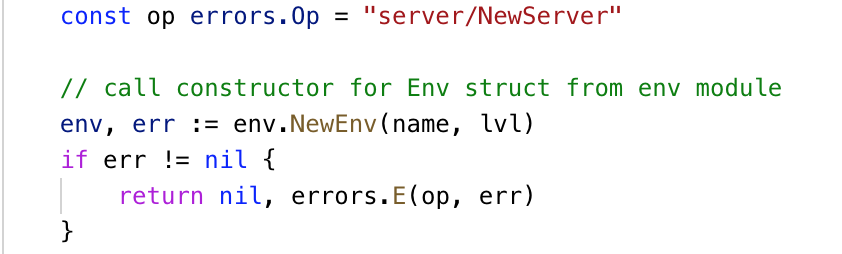
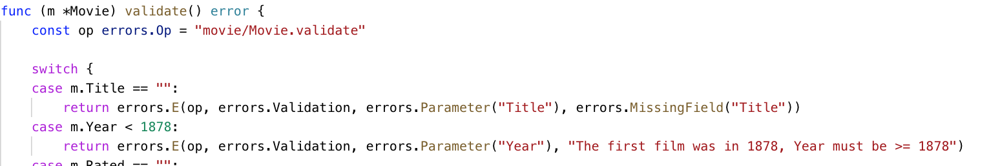
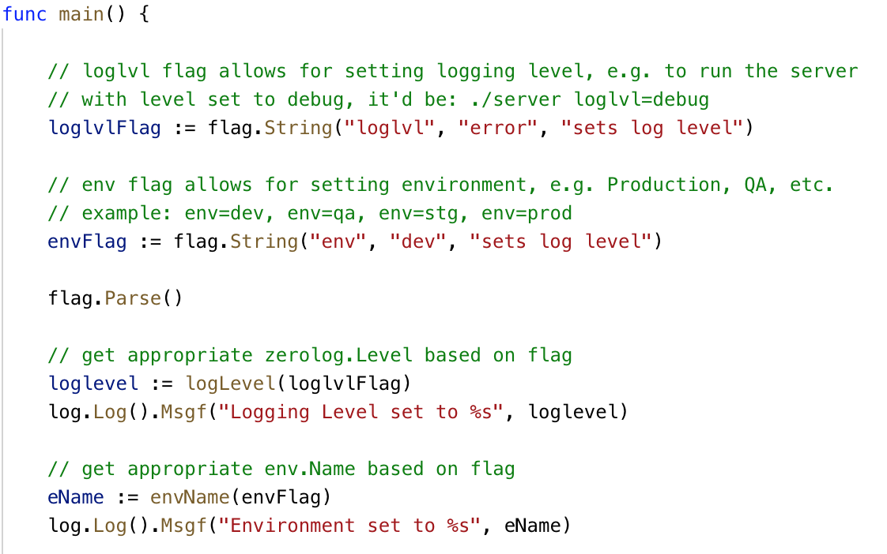

# go-API-basic

A RESTful API template (built with Go) - work in progress...

- The goal of this repo/API is to make an example/template of relational database-backed APIs that have characteristics needed to ensure success in a high volume environment.

## API Walkthrough

The following is an in-depth walkthrough of this repo as well as the module dependencies that are called within. This walkthrough has a stupid amount of detail. I know I'll lose the TL;DR crowd, but, I think, for some, this might be helpful.

### Errors

Before even getting into the full walkthrough, I wanted to review the [errors module](https://github.com/gilcrest/errors) as without a doubt, you'll see it called throughout the application. The errors module is basically a carve out of the error handling used in the [upspin library](https://github.com/upspin/upspin/tree/master/errors) with some tweaks and additions I made for my own needs. Rob Pike has a [fantastic post](https://commandcenter.blogspot.com/2017/12/error-handling-in-upspin.html) about errors and the upspin implementation. I've taken that and added my own twist. 

My general idea for error handling throughout this API and dependent modules is to always raise an error using the errors.E function as seen in this simple error handle below. Errors.E is neat - you can pass in any one of a number of approved types and the function helps form the error. In all error cases, I pass the errors.Op as the errors.E function helps build a pseudo stack trace for the error as it goes up through the code.



The following example shows a more robust validation example. In it, you'll notice that if you need to define your own error quickly, you can just use a string and insert that into an error as well.



You may also notice the errors.MissingField function used to validate missing input on fields, which comes from [this Mat Ryer post](https://medium.com/@matryer/patterns-for-decoding-and-validating-input-in-go-data-apis-152291ac7372)

```go
// MissingField is an error type that can be used when
// validating input fields that do not have a value, but should
type MissingField string

func (e MissingField) Error() string {
	return string(e) + " is required"
}
```

As errors go up the stack from whatever depth of code they're in, Upspin captures the operation and adds that to the error string as a pseudo stack trace that is super helpful for debugging. However, I don't want this type of internal stack information exposed to end users in the response - I only want the error message. As such, just prior to shipping the response, I log the error and then add the error to a function I created called errors.RE (**R**esponse **E**rror). This function effectively strips the stack information and just sends the original error message along with whatever http status code you select as well as whatever errors.Kind, Code or Parameter you choose to set. The response will look like so:


The [API/server layer module](https://github.com/gilcrest/go-api-basic) is the starting point and as such has the main package/function within the cmd directory. In it, I'm checking for a logging level command line flag. I'm using zerolog throughout my modules as my logger.



I'm then calling the NewServer function in the server package to construct a new server using the aforementioned logging level. The server's multiplex router is Gorilla, which is registered as the handler for http.Handle. Finally, http.ListenAndServe is run to truly start the server and listen for incoming requests.
Let's dig into the server.NewServer function above, as there are some peculiar things I should explain. In the server package, there is also a Server struct, which is composed of a pointer to the Server struct from the srvr module, as below:
type Server struct {
    *srvr.Server
}
This struct uses type embedding, which allows the Server struct defined in this API layer to take on all the properties of the Server struct from the srvr module (things like database setup, logger, multiplexer, etc.), but also allows me to extend the struct with API specific methods for routing logic and handlers. The Server struct in the srvr module has the following structure:
type Server struct {
    Router *mux.Router
    DS     *datastore.Datastore
    Logger zerolog.Logger
}
Within the NewServer function, I'm calling the NewServer function of the srvr module. I know - all this server naming is lame, but srvr.Server is meant to be embedded in the API specific server, so it makes sense to me… srvr.NewServer does all the database setup, starts the logger and gorilla multiplexer. After getting the srvr.Server back, I embed it in the local Server…If anyone has a better, more intuitive way of naming this, let me know!
Finally, I call the server.routes method and return the server.
Inside the server.routes method, first I pull out my app database from my server to pass into my servertoken handler.
Next I register my URL path and handlers to the router. I am using my own fork of Justinas Stankevičius' alice library as a module to make middleware chaining easier. Hopefully the original alice library will enable modules and I'll go back, but until then…
The first middleware in the chain above s.handleStdResponseHeader simply adds standard response headers - right now, it's just the Content-Type:application/json header, but it's an easy place to other headers I may eventually deem standard. 
Second middleware in the chain above, servertoken.Handler is an http handler from my servertoken module. There's a decent amount happening in this module, so let's dive in.
Through the magic of closures, the Handler function above is able to reference the request details. It pulls the API servertoken from the username portion of the Basic Authorization HTTP request header. I chose to do  API authorization with Basic Auth because it's easy to understand. Everyone does this differently. Authorization using Oauth2 (and now Webauthn) are something I need to use for many of my APIs as well, but that's a whole other article. For simplicity sake, I'll stick with Basic Auth. It's tried and true and in many use cases works perfectly. 
Once I've successfully parsed the token from the Basic Auth header, I set it inside my ServerToken type and call the Authorize method, sending the request context, logger, app db, path of the incoming request as well as the request method.
Inside the servertoken.Authorization method above, the first think I do is add the servertoken itself to the context using the Add2Ctx method below.
Next, I authorize the servertoken against my app database using the servertoken.authorizeDB method. You could do this in something like Redis for speed, but for keeping it simple for now, I used the same app db as everything else.
The table is super simple, see below (the server token below is not real).
The query is actually selecting from a stored function in the database. I waffle back and forth on whether this is a good idea (e.g. using stored functions or just querying from Go directly), but at least the authorizeDB function is an example of how to call a stored function returning a boolean and the below is the actual database function.