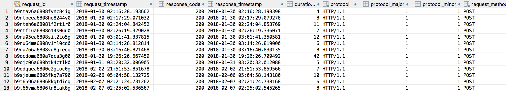

# go-API-template

A RESTful API template (built with Go).

- The goal of this app is to make an example/template of relational database-backed APIs that have characteristics needed to ensure success in a high volume environment.

- This is a work in progress - you'll notice most things below are not checked.  Any feedback and/or support are welcome. I have thick skin, so please feel free to tell me how bad something is and I'll make it better.

## Critical components of any API (in no particular order)

- [ ] Unit Testing (with reasonably high coverage %)
- [x] Verbose Code Documentation
- [ ] Instrumentation
  - [configurable http request/response logging](#configurable-logging) (ability to turn on and off logging style based on file configuration)
    - [x] [Log Style 1](#log-style-1-structured-via-json): Structured (JSON), leveled (debug, error, info, etc.) logging to stdout
    - [x] [Log Style 2](#Log-Style-2-Relational-DB-Logging-via-PostgreSQL): Relational database logging (certain data points broken out into standard column datatypes, request/response headers and body stored in TEXT datatype columns) - I chose PostgreSQL as my db of choice, but any db could do with some tweaks
    - [x] [Log Style 3](#Log-Style-3-httputil-DumpRequest-or-DumpResponse): httputil DumpRequest or DumpResponse - I don't do anything here, really - just allow you to turn these standard functions to be turned on or off via the config file
  - [ ] Helpful debug logging
  - [ ] API Metrics
  - [ ] Performance Monitoring
- [x] "Vendored" dependencies (done via [dep](https://golang.github.io/dep/))
  - Intentionally Minimal Dependencies
    - gorilla for routing, pq for postgres, zerolog for logging, xid for unique id generation
- [ ] Fault tolerant - Proper Error Raising/Handling
- [ ] RESTful service versioning
- [ ] Security/Authentication/Authorization using HTTPS/OAuth2, etc.
- [ ] Containerized
- [ ] Generated Client examples
- [ ] Extensive API Documentation for Clients of the API (see [twilio](https://www.twilio.com/docs/api/rest), [Uber](https://developer.uber.com/docs/riders/ride-requests/tutorials/api/introduction), [Stripe](https://stripe.com/docs/api/go#intro) and [mailchimp](http://developer.mailchimp.com/documentation/mailchimp/) as good examples - potentially use [Docusaurus](http://docusaurus.io/)

----

### Configurable Logging

Configurable http request/response logging is achieved through import/marshaling of a JSON file into the struct type `HTTPLogOpts`. The boolean fields found within this type drive the rules for what logging features are turned on.  You can have one to three log styles turned on using this file (or none, if you so choose).  I will eventually make this dynamic using some type of cacheing mechanism for the various choices.

#### Log Style 1: Structured via JSON

##### JSON Request Logging

Set `log_json.Request.enable` to true in the [HTTP Log Config File](#log-config-file) to enable http request logging as JSON (so long as you have properly "chained" the LogRequest handler/adapter middleware).  The output for a request looks something like:

```json
{"time":1517970302,"level":"info","header_json":"{\"Accept\":[\"*/*\"],\"Accept-Encoding\":[\"gzip, deflate\"],\"Cache-Control\":[\"no-cache\"],\"Connection\":[\"keep-alive\"],\"Content-Length\":[\"129\"],\"Content-Type\":[\"application/json\"],\"Postman-Token\":[\"9949f5e5-b406-4e22-aff3-ab6ba6e7d841\"],\"User-Agent\":[\"PostmanRuntime/7.1.1\"]}","body":"{\"username\": \"repoMan\",\"mobile_ID\": \"1-800-repoman\",\"email\":\"repoman@alwaysintense.com\",\"First_Name\":\"Otto\",\"Last_Name\":\"Maddox\"}","request_id":"b9t66vma6806ln8iak8g","method":"POST","scheme":"http","host":"127.0.0.1","port":"8080","path":"/api/v1/appUser","protocol":"HTTP/1.1","proto_major":1,"proto_minor":1,"Content Length":129,"Transfer-Encoding":"","Close":false,"RemoteAddr":"127.0.0.1:58689","RequestURI":"/api/v1/appUser","message":"Request received"}
```

>NOTE - the HTTP header key:value pairs and json from the body are represented as escaped JSON within the actual message. If you don't want this data, set these fields to false in the JSON config file (`httpLogOpt.json`)

##### JSON Response Logging

Set `log_json.Response.enable` to true in the [HTTP Log Config File](#Log-Config-File) to enable http response logging as JSON (so long as you have properly "chained" the LogResponse handler/adapter middleware).  The response output will look something like:

```json
{"time":1517970302,"level":"info","request_id":"b9t66vma6806ln8iak8g","response_code":200,"response_header":"{\"Content-Type\":[\"text/plain; charset=utf-8\"],\"Request-Id\":[\"b9t66vma6806ln8iak8g\"]}","response_body":"{\"username\":\"repoMan\",\"mobile_id\":\"1-800-repoman\",\"email\":\"repoman@alwaysintense.com\",\"first_name\":\"Otto\",\"last_name\":\"Maddox\",\"create_user_id\":\"gilcrest\",\"create_date\":\"2018-02-06T21:25:02.538322Z\",\"update_user_id\":\"\",\"update_date\":\"0001-01-01T00:00:00Z\"}\n{\"username\":\"repoMan\",\"mobile_id\":\"1-800-repoman\",\"email\":\"repoman@alwaysintense.com\",\"first_name\":\"Otto\",\"last_name\":\"Maddox\",\"create_user_id\":\"gilcrest\",\"create_date\":\"2018-02-06T21:25:02.538322Z\",\"update_user_id\":\"\",\"update_date\":\"0001-01-01T00:00:00Z\"}\n","message":"Response Sent"}
```

>NOTE - same as request - the HTTP header key:value pairs and json from the body are represented as escaped JSON within the actual message. If you don't want this data, set these fields to false in the JSON config file (`httpLogOpt.json`)

#### Log Style 2: Relational DB Logging via PostgreSQL

Set `log_2DB.enable` to true in the [HTTP Log Config File](#Log-Config-File) to enable Database logging to a PostgreSQL database.  The DDL is provided within the ddl directory (`audit_log.sql`) and consists of one table and one stored function. Once enabled, Request and Response information will be logged as one transaction to the database.  You can optionally choose to log request and response headers using the Options fields within the [HTTP Log Config File](#Log-Config-File).



In total 19 fields are logged as part of the database transaction.

| Column Name   | Datatype    | Description          |
| ------------- | ----------- | -------------------- |
| request_id                | VARCHAR(100)  | Unique Request ID
| request_timestamp         | TIMESTAMP     | UTC time request received
| response_code             | INTEGER       | HTTP Response Code
| response_timestamp        | TIMESTAMP     | UTC time response sent
| duration_in_millis        | BIGINT        | Response time duration in milliseconds
| protocol                  | VARCHAR(20)   | HTTP protocol version, e.g. HTTP/1.1
| protocol_major            | INTEGER       | HTTP protocol major version
| protocol_minor            | INTEGER       | HTTP protocol minor version
| request_method            | VARCHAR(10)   | HTTP method (GET, POST, PUT, etc.)
| scheme                    | VARCHAR(100)  | URL scheme (http, https, etc.)
| host                      | VARCHAR(100)  | URL host
| port                      | VARCHAR(100)  | URL port
| path                      | VARCHAR(4000) | URL path
| remote_address            | VARCHAR(100)  | Network address which sent request
| request_content_length    | BIGINT        | Request content length
| request_header            | JSONB         | Key:Value pairs from HTTP request in JSON format
| request_body              | TEXT          | Request body content
| response_header           | JSONB         | Key:Value pairs from HTTP response in JSON format
| response_body             | TEXT          | Response body content

#### Log Style 3: httputil DumpRequest or DumpResponse

##### httputil.DumpRequest

Set `httputil.DumpRequest.enable` to true in the [HTTP Log Config File](#Log-Config-File) to enable logging the request via the [httputil.DumpRequest](https://golang.org/pkg/net/http/httputil/#DumpRequest) method. I'm not doing anything special here - just providing an easy way to turn this on or off.  Output typically looks like:

```bash
httputil.DumpRequest output:
POST /api/v1/appUser HTTP/1.1
Host: 127.0.0.1:8080
Accept: */*
Accept-Encoding: gzip, deflate
Cache-Control: no-cache
Connection: keep-alive
Content-Length: 129
Content-Type: application/json
Postman-Token: 6d1b2461-59e2-4c87-baf5-d8e64a93c55b
User-Agent: PostmanRuntime/7.1.1

{"username": "repoMan","mobile_ID": "1-800-repoman","email":"repoman@alwaysintense.com","First_Name":"Otto","Last_Name":"Maddox"}{"time":1517893498,"level":"debug","message":"Start Handler.ServeHTTP"}
```

#### Log Config File

`/pkg/input/httpLogOpt.json`

```json
{
    "httputil": {
        "DumpRequest": {
            "enable": false,
            "body": true
        }
    },
    "log_json": {
        "Request": {
            "enable": false,
            "Options": {
                "header": true,
                "body": true
            }
        },
        "Response": {
            "enable": false,
            "Options": {
                "header": true,
                "body": true
            }
        }
    },
    "log_2DB": {
        "enable": false,
        "Request": {
            "header": true,
            "body": true
        },
        "Response": {
            "header": true,
            "body": true
        }
    }
}
```

## Helpful Resources I've used in this app (outside of the standard, yet amazing blog.golang.org and golang.org/doc/, etc.)

websites/youtube

- [JustforFunc](https://www.youtube.com/channel/UC_BzFbxG2za3bp5NRRRXJSw)

- [Go By Example](https://gobyexample.com/)

Books

- [Go in Action](https://www.amazon.com/Go-Action-William-Kennedy/dp/1617291781)
- [The Go Programming Language](https://www.amazon.com/Programming-Language-Addison-Wesley-Professional-Computing/dp/0134190440/ref=pd_lpo_sbs_14_t_0?_encoding=UTF8&psc=1&refRID=P9Z5CJMV36NXRZNXKG1F)

Blog/Medium Posts

- [The http Handler Wrapper Technique in #golang, updated -- by Mat Ryer](https://medium.com/@matryer/the-http-handler-wrapper-technique-in-golang-updated-bc7fbcffa702)
- [Writing middleware in #golang and how Go makes it so much fun. -- by Mat Ryer](https://medium.com/@matryer/writing-middleware-in-golang-and-how-go-makes-it-so-much-fun-4375c1246e81)
- [http.Handler and Error Handling in Go -- by Matt Silverlock](https://elithrar.github.io/article/http-handler-error-handling-revisited/)
- [How to correctly use context.Context in Go 1.7 -- by Jack Lindamood](https://medium.com/@cep21/how-to-correctly-use-context-context-in-go-1-7-8f2c0fafdf39)
- [Standard Package Layout](https://medium.com/@benbjohnson/standard-package-layout-7cdbc8391fc1)
- [Practical Persistence in Go: Organising Database Access](http://www.alexedwards.net/blog/organising-database-access)
- [Writing a Go client for your RESTful API](https://medium.com/@marcus.olsson/writing-a-go-client-for-your-restful-api-c193a2f4998c)
